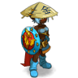
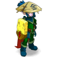
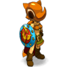

# DatBot
> DatBot is a project based on the video game Dofus. It's a fullstack bot that can do multiple things in the game, such as : Fishing, Gathering, Fighting, Treasure Hunting, ...

DatBot was the first bot of the BlackFalcon's team. **It is no longer maintained.**

You can check out our new project : <a href="https://github.com/ProjectBlackFalcon/BlackFalconCore">BlackFalconCore</a>

## Specifications

DatBot uses two languages  :

- **Java** as a controller, to interact with the game.
- **Pyhton** as a model. 

There is also a <a href="https://github.com/ProjectBlackFalcon/WebInterface">web interface</a> to visualise the performances of the bots.

## Fallen Heroes

> You will always be remembered...

| **Ilancelet** | **Gradopr** | **Tsuuaf** 
| :---: |:---:| :---:|
|    |  |  |
| 2018-03-19 - lvl 117 | 2018-07-31 - lvl 160 | 2018-08-08 - lvl 139 |

## License

- **[MIT license](http://opensource.org/licenses/mit-license.php)**
